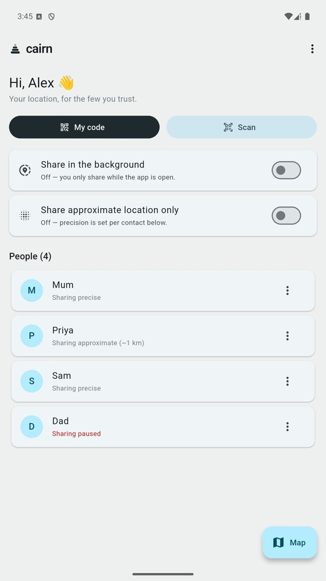
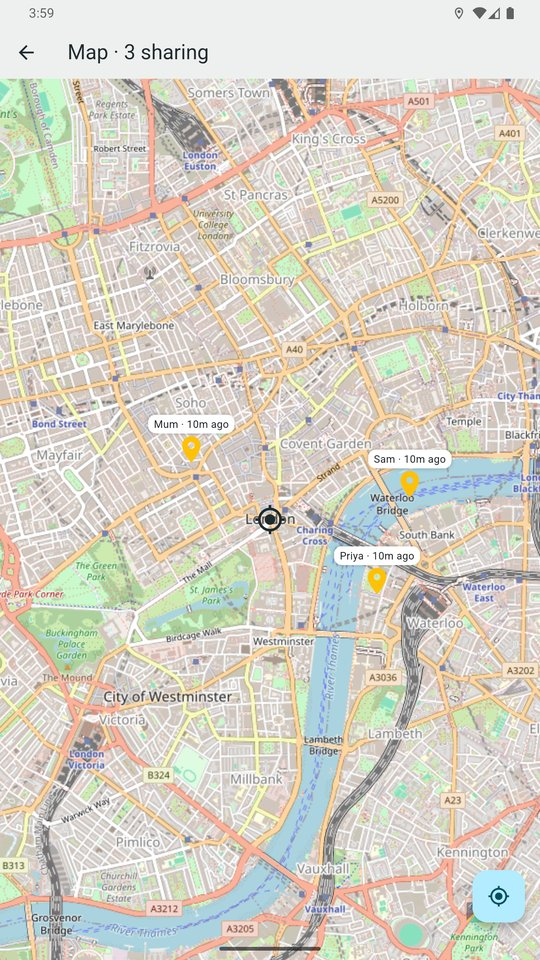
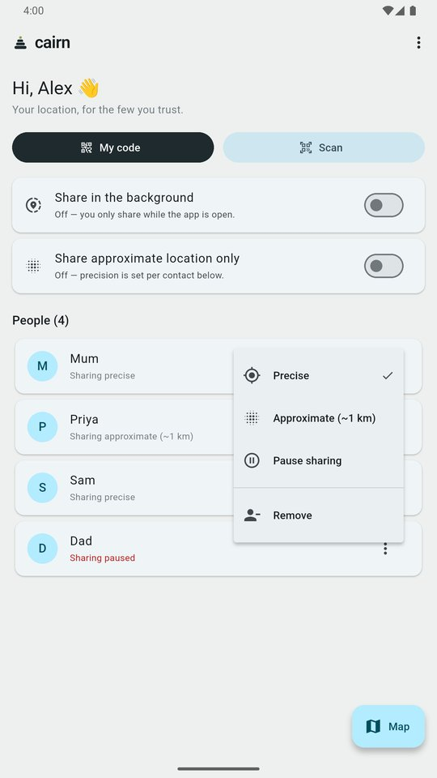
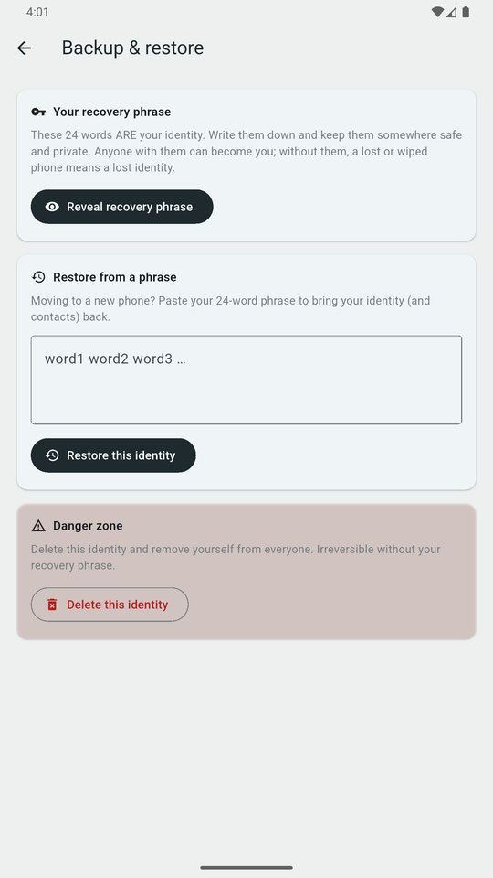

<div align="center">


# Cairn

**Your location, for the few you trust.**

Private, end-to-end encrypted location sharing that you can host yourself.
By [CappyLabs](https://cairn.cappylabs.uk).

[](https://github.com/CappyTech/cairn/actions/workflows/release.yml)
[](LICENSE)
[](#how-it-works)
[](https://flutter.dev)

[Website](https://cairn.cappylabs.uk) · [Beta](https://cairn.cappylabs.uk/beta) · [Support](https://cairn.cappylabs.uk/support) · [Security](https://cairn.cappylabs.uk/security) · [Privacy](https://cairn.cappylabs.uk/privacy)

<br>

&nbsp;
&nbsp;
&nbsp;


</div>

---

Cairn lets you share your live location with the specific people you choose, and
see theirs on a map. Your location — and even your display name — are
**end-to-end encrypted**, so the server relays them but **cannot read them**.

> Coming soon to Android and iOS. Cairn is pre-release; Android builds go to
> Google Play's internal track. Want to try it?
> [Sign up to test](https://cairn.cappylabs.uk/beta).

## Why Cairn

- **Private by design** — location and display name are end-to-end encrypted (X25519 + ChaCha20-Poly1305). The server can't read them.
- **No account, no tracking** — no email, phone, or password. Your identity is a key generated on your device. No ads, no analytics, nothing sold.
- **You stay in control** — pair in person, choose how precisely you share with each person, and pause or stop any time.
- **Yours to run** — point the app at your own server and your data never leaves it.

## Features

**Sharing**
- 🔒 **End-to-end encrypted location** — only your chosen contacts can decrypt it.
- 📷 **QR pairing** — connect in person; only people you show your code to can pair. Not nearby? Send a **one-time invite code** that expires in 24 hours.
- 🎯 **Per-person precision** — precise, approximate (~1 km), or paused, per person; plus a global "approximate only" switch.
- ⏸️ **Pause sharing for a while** — for an hour, three hours, until tomorrow, or until you resume. Nobody sees you meanwhile.
- 🌙 **Background sharing** (optional) — keeps sharing while the app is closed, with a notification always showing, and backs off on a low battery.
- 🏷️ **Status, battery, speed and direction** — show a label like "Hotel", your battery level, and (if you choose) how fast and which way you're moving.

**Map**
- 🗺️ **Live map** — tap someone to see them with their details: freshness, distance, battery and more.
- 👥 **People strip and Show everyone** — jump between people, or fit everyone on screen.
- 🧭 **Directions** — open the route to someone, or to a shared pin, in your phone's maps app.
- 📌 **Shared pins** — send a spot ("meet here", "where I'm staying") to chosen contacts.

**History and places**
- 🕓 **History and trips** — your trail, and the trails of people sharing with you (switchable per person), encrypted so only you can read it. Optionally snap trips to roads.
- 🏠 **Places and alerts** — private geofences such as Home or Work, with arrive and leave alerts.
- 🔔 **Activity alerts** — new connections and people going quiet, each with its own sound.

**Your identity**
- 🔑 **24-word recovery phrase** — back up and restore your identity on a new phone.
- 🗑️ **Delete anytime** — remove your identity and all its data from within the app.
- 🎨 **Your layout** — three Home layouts, and light, dark or system theme.

## What the server *can* and *can't* see

| Data | Server can read? |
|---|---|
| Location | ❌ No — end-to-end encrypted |
| Display name | ❌ No — end-to-end encrypted |
| Location history and places | ❌ No — encrypted to you |
| Shared pins | ❌ No — encrypted to each recipient |
| Public keys, who's paired with whom, timestamps | ✅ Yes (pseudonymous routing metadata) |

Updates go out on a fixed schedule and are padded, so their timing and size don't
reveal when you're moving. Hiding the routing metadata (the social graph) would
need a metadata-private protocol — a future goal; see
[docs/metadata-privacy.md](docs/metadata-privacy.md) and the
[security page](https://cairn.cappylabs.uk/security).

## How it works

- **App:** Flutter (Android; iOS pending a Mac to build).
- **Backend:** self-hosted [PocketBase](https://pocketbase.io) — auth, realtime, and per-record access rules. It stores only ciphertext for locations and names.
- **Identity:** an on-device X25519 keypair *is* the account; PocketBase credentials are derived from it silently.

## Self-hosting

The app works against the default server, or run your own:

```bash
# on your server (Docker)
docker compose up -d          # see deploy/docker-compose.yml
```

The `Dockerfile` builds an image = PocketBase + the web build + schema
migrations (`pb_migrations/`), so a fresh server comes up fully configured. A
reverse proxy (e.g. Caddy) terminates HTTPS in front of it. Point the app at
your server in **Settings → Server address**.

## Development

```bash
flutter pub get
flutter run                                   # defaults to the production backend
flutter run --dart-define=PB_URL=http://10.0.2.2:8090   # local backend (emulator)
flutter test --exclude-tags integration       # as CI runs it
flutter test --tags integration               # needs a local PocketBase on :8090
```

Build a release:

```bash
flutter build appbundle --release   # signed via android/key.properties (CI provides it)
```

## CI/CD

GitHub Actions:

- **`ci.yml`** — every pull request and non-`main` branch: `flutter analyze` and the test suite.
- **`release.yml`, push to `main`** → build web → push `ghcr.io/cappytech/cairn-server` → deploy to the edge over SSH.
- **`release.yml`, push a tag `vX.Y.Z`** → build a signed `.aab` (version from the tag), attach it as an artifact, and upload to Google Play (internal track) with release notes from `distribution/whatsnew/`.

## Privacy and security

- [Privacy policy](https://cairn.cappylabs.uk/privacy)
- [Delete your data](https://cairn.cappylabs.uk/delete)
- [Security, and how to report a vulnerability](https://cairn.cappylabs.uk/security)

## Licence

Cairn is free software under the [GNU Affero General Public License v3.0](LICENSE)
(AGPL-3.0). If you run a modified Cairn server for others to use, you must
offer them the source of your changes.

---

<div align="center"><em>Cairn — your location, for the few you trust.</em></div>
